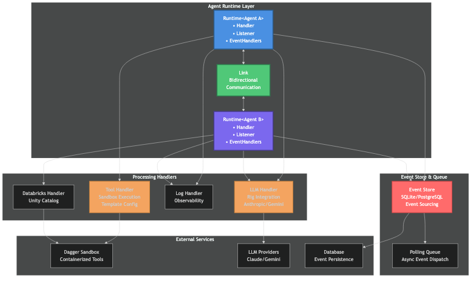
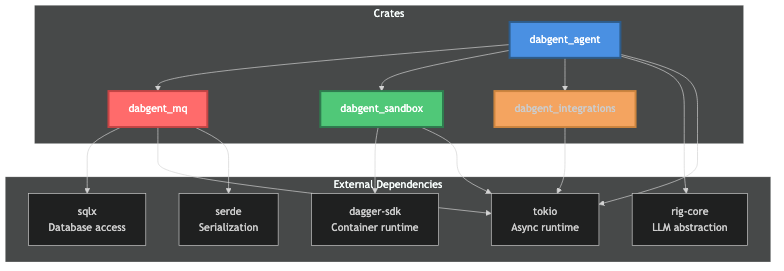
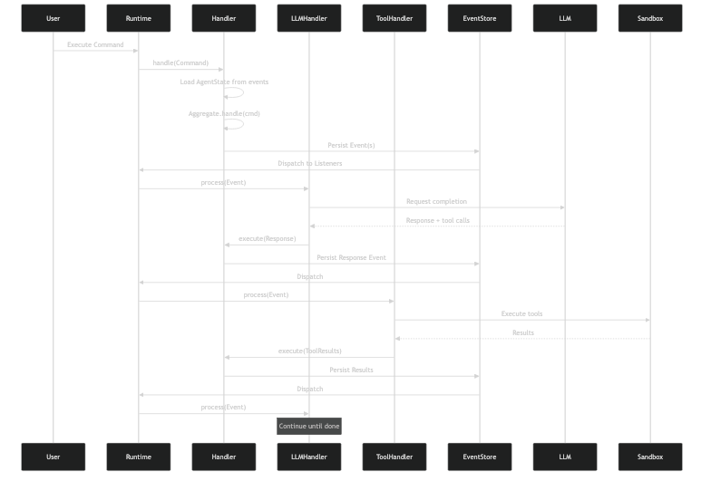
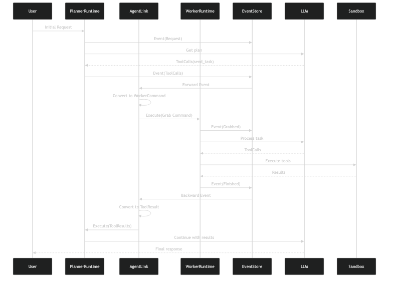
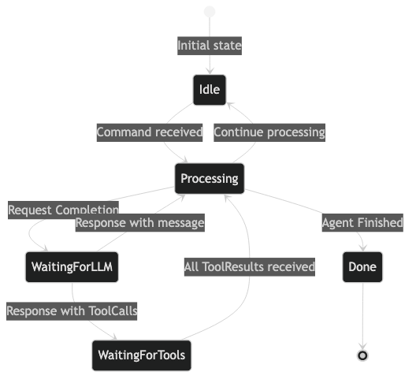

# Dabgent - System Design Document

## 1. Executive Summary

Dabgent is a modular event-sourced AI agent orchestration system built in Rust that enables autonomous multi-agent task execution through Large Language Models (LLMs). The system provides a robust framework for composing, linking, and coordinating multiple specialized agents with tool integration, sandboxed execution, and persistent event streams.

### Key Features
- **Event-Sourced Architecture**: Full event history with aggregate state reconstruction
- **Multi-Agent Coordination**: Link multiple agents with bidirectional communication
- **Pluggable LLM Support**: Provider-agnostic LLM integration (Anthropic, Gemini via Rig)
- **Sandboxed Execution**: Dagger-based containerized tool execution
- **Agent Specialization**: Define custom agents with domain-specific capabilities
- **Type-Safe Event Handling**: Strongly-typed events, commands, and responses
- **Async Runtime**: Tokio-based concurrent processing with event queue

## 2. System Architecture

### 2.1 High-Level Architecture



### 2.2 Component Overview

| Component | Responsibility | Key Traits/Types | Core Modules |
|-----------|---------------|------------------|--------------|
| **dabgent_agent** | Agent orchestration, event handling, coordination | `Agent`, `Runtime`, `Link`, `EventHandler` | `processor/agent.rs`, `processor/link.rs`, `processor/llm.rs`, `processor/tools.rs` |
| **dabgent_mq** | Event sourcing, aggregate management, persistence | `Aggregate`, `EventStore`, `Handler`, `Listener` | `aggregate.rs`, `listener.rs`, `db/sqlite.rs` |
| **dabgent_sandbox** | Isolated tool execution in containers | `Sandbox`, `SandboxHandle`, `DaggerSandbox` | `dagger.rs`, container orchestration |
| **dabgent_integrations** | External service integrations | `DatabricksRestClient`, API clients | `databricks.rs` |
| **toolbox** | Reusable tool definitions | `Tool`, `Validator`, toolsets | `basic.rs`, tool implementations |

### 2.3 Dependency Graph



## 3. Core Components Design

### 3.1 Agent Trait and Runtime (`dabgent_agent/src/processor/agent.rs`)

The `Agent` trait defines the contract for custom agent implementations:

```rust
pub trait Agent: Default + Send + Sync + Clone {
    const TYPE: &'static str;
    type AgentCommand: Send;
    type AgentEvent: MQEvent;
    type AgentError: std::error::Error + Send + Sync + 'static;
    type Services: Send + Sync;

    async fn handle_tool_results(
        state: &AgentState<Self>,
        services: &Self::Services,
        incoming: Vec<ToolResult>,
    ) -> Result<Vec<Event<Self::AgentEvent>>, Self::AgentError>;

    async fn handle_command(
        state: &AgentState<Self>,
        cmd: Self::AgentCommand,
        services: &Self::Services,
    ) -> Result<Vec<Event<Self::AgentEvent>>, Self::AgentError>;

    fn apply_event(state: &mut AgentState<Self>, event: Event<Self::AgentEvent>);
}
```

**Key Concepts:**
- **AgentState**: Aggregate state including agent data, pending tool calls, message history
- **Command-Event Pattern**: Commands trigger state changes via events
- **Type Safety**: Strongly-typed commands, events, and errors per agent
- **Services**: Dependency injection for shared resources

#### Runtime System

```rust
pub struct Runtime<A: Agent, ES: EventQueue> {
    pub handler: Handler<AgentState<A>, ES>,
    pub listener: Listener<AgentState<A>, ES>,
}
```

**Runtime Responsibilities:**
- Initialize event handlers and listeners
- Coordinate event processing across handlers
- Manage aggregate lifecycle
- Support handler composition

### 3.2 Event Handlers

Handlers process events and trigger side effects:

#### LLM Handler (`processor/llm.rs`)
- Processes `Request::Completion` events
- Calls LLM provider (via Rig)
- Emits `Response::Completion` with LLM output
- Handles tool calls from LLM

#### Tool Handler (`processor/tools.rs`)
- Processes `Request::ToolCalls` events
- Executes tools in sandbox
- Uses template configuration for file operations
- Emits `Response::ToolResults`

#### Log Handler (`processor/utils.rs`)
- Observability and debugging
- Logs all events flowing through the system
- Non-blocking, side-effect only

### 3.3 Link System (`dabgent_agent/src/processor/link.rs`)

The `Link` trait enables bidirectional communication between agents:

```rust
pub trait Link<ES: EventStore>: Send + Sync {
    type RuntimeA: Agent;
    type RuntimeB: Agent;

    async fn forward(
        &self,
        a_id: &str,
        event: &Event<<Self::RuntimeA as Agent>::AgentEvent>,
        handler: &Handler<AgentState<Self::RuntimeA>, ES>,
    ) -> Option<(String, Command<<Self::RuntimeB as Agent>::AgentCommand>)>;

    async fn backward(
        &self,
        b_id: &str,
        event: &Event<<Self::RuntimeB as Agent>::AgentEvent>,
        handler: &Handler<AgentState<Self::RuntimeB>, ES>,
    ) -> Option<(String, Command<<Self::RuntimeA as Agent>::AgentCommand>)>;
}
```

**Use Cases:**
- **Planner-Worker**: Planner delegates tasks, worker reports completion
- **Main-Specialist**: Main agent delegates specialized work (e.g., Databricks exploration)
- **Chain of Agents**: Sequential task processing across multiple agents

**Example from `planner_worker.rs`:**
- Planner emits `Request::ToolCalls` with `send_task` tool
- Link's `forward()` converts to `WorkerCommand::Grab`
- Worker processes task and emits `WorkerEvent::Finished`
- Link's `backward()` converts to `Response::ToolResults` for planner

### 3.4 Event Sourcing with dabgent_mq

#### Aggregate Pattern

Agents implement the `Aggregate` trait from `dabgent_mq`:

```rust
impl<A: Agent> Aggregate for AgentState<A> {
    const TYPE: &'static str = A::TYPE;
    type Command = Command<A::AgentCommand>;
    type Event = Event<A::AgentEvent>;
    type Services = A::Services;
    type Error = AgentError<A::AgentError>;

    async fn handle(&self, cmd: Command, services: &Services)
        -> Result<Vec<Event>, Error>;

    fn apply(&mut self, event: Event);
}
```

**Key Properties:**
- **Event Stream**: All state changes persisted as events
- **State Reconstruction**: Replay events to rebuild current state
- **Atomic Commands**: Commands either succeed (emit events) or fail (no state change)
- **Decoupled Handlers**: Multiple handlers can react to same events

#### Event Store Backends

- **SQLite**: In-memory or file-based for development/testing
- **PostgreSQL**: Production-ready with ACID guarantees
- **Polling Queue**: Async event dispatch to listeners

### 3.5 Toolbox System (`dabgent_agent/src/toolbox/`)

#### Tool Interface

```rust
pub trait Tool: Send + Sync {
    fn name(&self) -> String;
    fn definition(&self) -> ToolDefinition;
    async fn call(&self, args: Value, sandbox: &mut impl Sandbox) -> Result<String>;
}

pub trait Validator: Send + Sync {
    async fn run(&self, sandbox: &mut DaggerSandbox) -> Result<Result<(), String>>;
}
```

#### Basic Toolset (`toolbox/basic.rs`)

| Tool | Description | Sandbox Usage |
|------|-------------|---------------|
| **ReadFile** | Read file contents | Yes |
| **WriteFile** | Write file with content | Yes |
| **EditFile** | Apply diff/replace operations | Yes |
| **RmFile** | Delete file | Yes |
| **Bash** | Execute shell commands | Yes |
| **LsFile** | List directory | Yes |
| **Done** | Signal task completion | No |

**Validator Pattern**: Custom validators check task success (e.g., run tests, check output)

## 4. Data Flow and Sequences

### 4.1 Single Agent Execution Flow



### 4.2 Multi-Agent Linked Execution (Planner-Worker Pattern)



### 4.3 Agent State Machine



## 5. Example Usage Patterns

### 5.1 Basic Single Agent (`examples/basic.rs`)

```rust
// Define custom agent
#[derive(Debug, Clone, Default, Serialize, Deserialize)]
pub struct Basic {
    pub done_call_id: Option<String>,
}

impl Agent for Basic {
    const TYPE: &'static str = "basic_worker";
    type AgentCommand = ();
    type AgentEvent = BasicEvent;
    type AgentError = BasicError;
    type Services = ();

    async fn handle_tool_results(
        state: &AgentState<Self>,
        _: &Self::Services,
        incoming: Vec<ToolResult>,
    ) -> Result<Vec<Event<Self::AgentEvent>>, Self::AgentError> {
        // Process results, emit events
    }

    fn apply_event(state: &mut AgentState<Self>, event: Event<Self::AgentEvent>) {
        // Update agent state
    }
}

// Setup runtime
let runtime = Runtime::<Basic, _>::new(store, ())
    .with_handler(llm_handler)
    .with_handler(tool_handler)
    .with_handler(log_handler);

runtime.handler.execute("basic", Command::SendRequest(...)).await?;
runtime.start().await?;
```

### 5.2 Multi-Agent with Link (`examples/planner_worker.rs`)

```rust
// Create two runtimes
let mut planner_runtime = Runtime::<Planner, _>::new(store.clone(), ())
    .with_handler(planner_llm)
    .with_handler(log_handler);

let mut worker_runtime = Runtime::<Worker, _>::new(store.clone(), ())
    .with_handler(worker_llm)
    .with_handler(worker_tool_handler)
    .with_handler(log_handler);

// Link them
link_runtimes(&mut planner_runtime, &mut worker_runtime, PlannerWorkerLink);

// Start both
tokio::spawn(async move { planner_runtime.start().await });
tokio::spawn(async move { worker_runtime.start().await });
```

### 5.3 Specialized Integration (`examples/databricks_worker.rs`)

```rust
// Main agent delegates to Databricks specialist
let databricks_client = Arc::new(DatabricksRestClient::new()?);
let databricks_handler = DatabricksToolHandler::new(databricks_client, tools);

let mut databricks_runtime = Runtime::<DatabricksWorker, _>::new(store, ())
    .with_handler(databricks_llm)
    .with_handler(databricks_handler);

link_runtimes(&mut main_runtime, &mut databricks_runtime, DatabricksLink);
```

## 6. Event Store Schema

### 6.1 Event Sourcing Tables

```sql
-- Aggregates table (tracks aggregate metadata)
CREATE TABLE aggregates (
    aggregate_id TEXT PRIMARY KEY,
    aggregate_type TEXT NOT NULL,
    version INTEGER NOT NULL DEFAULT 0,
    created_at TIMESTAMP NOT NULL DEFAULT CURRENT_TIMESTAMP,
    updated_at TIMESTAMP NOT NULL DEFAULT CURRENT_TIMESTAMP
);

-- Events table (immutable event log)
CREATE TABLE events (
    id INTEGER PRIMARY KEY AUTOINCREMENT,
    aggregate_id TEXT NOT NULL,
    aggregate_type TEXT NOT NULL,
    event_type TEXT NOT NULL,
    event_version TEXT NOT NULL,
    payload TEXT NOT NULL,  -- JSON serialized event data
    metadata TEXT,          -- JSON serialized metadata
    sequence INTEGER NOT NULL,
    created_at TIMESTAMP NOT NULL DEFAULT CURRENT_TIMESTAMP,
    FOREIGN KEY (aggregate_id) REFERENCES aggregates(aggregate_id),
    UNIQUE (aggregate_id, sequence)
);

CREATE INDEX idx_aggregate_events ON events(aggregate_id, sequence);
CREATE INDEX idx_event_type ON events(event_type);
CREATE INDEX idx_created_at ON events(created_at);
```

**Key Properties:**
- **Append-Only**: Events are never updated or deleted
- **Ordered**: Sequence numbers ensure event ordering per aggregate
- **Typed**: Event type and version for schema evolution
- **Metadata**: Correlation IDs, causation tracking

## 7. Configuration

### 7.1 Environment Variables

```bash
# LLM Provider API Keys
ANTHROPIC_API_KEY=your_anthropic_key
GEMINI_API_KEY=your_gemini_key

# Databricks (if using Databricks integration)
DATABRICKS_HOST=https://your-workspace.databricks.com
DATABRICKS_TOKEN=your_databricks_token

# Logging
RUST_LOG=dabgent=debug,dabgent_agent=trace

# Dagger Engine (optional, auto-detected)
_EXPERIMENTAL_DAGGER_RUNNER_HOST=unix:///var/run/buildkit/buildkitd.sock
```

### 7.2 Runtime Configuration

Configuration is code-based via builders:

```rust
// LLM Configuration
let llm_config = LLMConfig {
    model: "claude-sonnet-4-20250514".to_string(),
    preamble: Some("You are a helpful assistant".to_string()),
    tools: Some(tool_definitions),
    max_tokens: Some(4096),
    temperature: Some(0.7),
    ..Default::default()
};

// Sandbox Configuration
let sandbox_config = SandboxConfig {
    work_dir: Some(PathBuf::from("./workspace")),
    base_image: "python:3.11".to_string(),
    ..Default::default()
};

// Template Configuration for file tools
let template_config = TemplateConfig::default_dir("./templates");
```

## 8. Error Handling

### 8.1 Agent Error Pattern

Each agent defines its own error type:

```rust
#[derive(Debug, thiserror::Error)]
pub enum AgentError<E: std::error::Error> {
    #[error("Shared error: {0}")]
    Shared(#[from] Error),
    #[error("Agent error: {0}")]
    Agent(#[source] E),
}

#[derive(Debug, thiserror::Error)]
pub enum Error {
    #[error("Invalid state transition")]
    InvalidState,
    #[error("Not ready for completion")]
    NotReady,
    #[error("Unexpected tool result with id: {0}")]
    UnexpectedTool(String),
}
```

### 8.2 Command Failure Semantics

- **Command fails**: No events emitted, state unchanged
- **Command succeeds**: Events persisted, state updated
- **Handler errors**: Logged but don't affect aggregate state
- **Idempotent replays**: Re-applying events produces same state

### 8.3 Error Observability

- All errors logged via `tracing` crate
- Event metadata tracks causation chain
- Failed commands emit error logs but not error events
- Handlers can implement custom error recovery

## 9. Security Considerations

### 9.1 Dagger Sandbox Isolation

Dagger provides strong isolation guarantees:

- **Containerized Execution**: Each tool runs in isolated container
- **File System Isolation**: No access to host filesystem except mounted workspace
- **Network Isolation**: Configurable network access policies
- **Resource Limits**: CPU, memory, and disk quotas enforced
- **Ephemeral Containers**: Automatically cleaned up after execution

### 9.2 Tool Execution Safety

- **Workspace Boundaries**: Tools operate only within designated workspace
- **Validation**: Custom validators verify tool execution results
- **Audit Trail**: All tool executions logged in event store
- **Rollback**: Event sourcing enables state rollback on failure

### 9.3 API Key Management

- **Environment Variables**: API keys loaded from environment, not code
- **No Persistence**: Keys never persisted to event store
- **Service Injection**: Keys provided via Services, not state
- **Minimal Scope**: Each agent only receives necessary credentials

## 10. Performance Characteristics

### 10.1 Concurrency Model

- **Async Runtime**: Tokio for non-blocking I/O
- **Event Queue**: Polling-based event dispatch with configurable intervals
- **Parallel Agents**: Multiple agent runtimes run concurrently via `tokio::spawn`
- **Handler Composition**: Multiple handlers process same event independently
- **Optimistic Concurrency**: Event sequence numbers prevent conflicts

### 10.2 Scalability Considerations

| Component | Characteristics | Scaling Strategy |
|-----------|----------------|------------------|
| **Runtime** | Single aggregate per runtime instance | Spawn multiple runtimes for parallelism |
| **Event Store** | SQLite: local, PostgreSQL: distributed | Partition by aggregate_id |
| **Handlers** | Independent, async processing | Add handlers without runtime changes |
| **Sandbox** | Dagger manages container lifecycle | Dagger handles resource pooling |
| **LLM Calls** | Network I/O bound | Async concurrent requests |

### 10.3 Performance Optimizations

- **Event Batching**: Multiple events persisted in single transaction
- **Lazy State Loading**: Aggregate state loaded on-demand
- **Handler Parallelism**: Independent handlers run concurrently
- **Container Reuse**: Dagger caches container layers

## 11. Testing Strategy

### 11.1 Event Sourcing Testing

Event sourcing enables powerful testing patterns:

```rust
#[tokio::test]
async fn test_agent_behavior() {
    // Given: Initial state
    let store = in_memory_store().await;
    let handler = Handler::new(store, ());

    // When: Execute command
    handler.execute("test_id", Command::SendRequest(...)).await?;

    // Then: Assert events
    let events = handler.get_events("test_id").await?;
    assert_eq!(events.len(), 2);
    assert!(matches!(events[0], Event::Request(_)));
}
```

### 11.2 Testing with Examples

The `examples/` directory serves dual purpose:
- **Documentation**: Show real usage patterns
- **Integration Tests**: Run examples as integration tests

```bash
cargo run --example basic
cargo run --example planner_worker
cargo run --example databricks_worker
```

### 11.3 Mock Strategies

- **In-Memory Store**: SQLite `:memory:` for fast tests
- **Mock LLM**: Predefined responses for deterministic tests
- **Mock Sandbox**: Simulate tool execution without containers
- **Event Replay**: Test state reconstruction from events

## 12. Key Architecture Patterns

### 12.1 Event Sourcing Benefits

- **Audit Trail**: Complete history of all agent actions
- **Time Travel**: Replay events to any point in time
- **Debugging**: Understand exactly what happened and why
- **Reprocessing**: Fix bugs and replay events with corrected logic
- **Analytics**: Query event stream for insights

### 12.2 Agent Composition Patterns

**Single Agent**: Simple tasks with one LLM and toolset
```rust
Runtime::new(store, services)
    .with_handler(llm_handler)
    .with_handler(tool_handler)
```

**Linked Agents**: Delegation and specialization
```rust
link_runtimes(&mut main, &mut specialist, CustomLink)
```

**Multiple Parallel Agents**: Independent concurrent work
```rust
tokio::spawn(async move { agent_a.start().await });
tokio::spawn(async move { agent_b.start().await });
```

### 12.3 Extensibility Points

- **Custom Agents**: Implement `Agent` trait with domain logic
- **Custom Tools**: Implement `Tool` trait for new capabilities
- **Custom Handlers**: Implement `EventHandler` for side effects
- **Custom Links**: Implement `Link` for agent coordination
- **Custom Validators**: Implement `Validator` for task verification

## 13. Observability

### 13.1 Logging with Tracing

```rust
use tracing::{info, debug, error, instrument};

#[instrument(skip(self))]
async fn handle_command(&self, cmd: Command) -> Result<()> {
    info!("Processing command");
    debug!(?cmd, "Command details");
    // ...
}
```

### 13.2 Event Stream Analysis

Query event store for insights:
```sql
-- Find all failed tool executions
SELECT * FROM events
WHERE event_type = 'response'
  AND payload LIKE '%error%';

-- Analyze agent execution times
SELECT aggregate_id,
       MIN(created_at) as start,
       MAX(created_at) as end
FROM events
GROUP BY aggregate_id;
```

## 14. Conclusion

Dabgent provides a robust, event-sourced framework for multi-agent AI orchestration with emphasis on:

- **Event Sourcing**: Complete audit trail and state reconstruction
- **Multi-Agent Coordination**: Link agents for complex workflows
- **Type Safety**: Strongly-typed events, commands, and errors
- **Sandboxed Execution**: Secure containerized tool execution
- **Extensibility**: Custom agents, tools, handlers, and links
- **Observability**: Full event logging and tracing
- **Testability**: Event replay and in-memory testing

The architecture enables building complex multi-agent systems through composition of simple, well-defined components with strong isolation guarantees and complete observability.